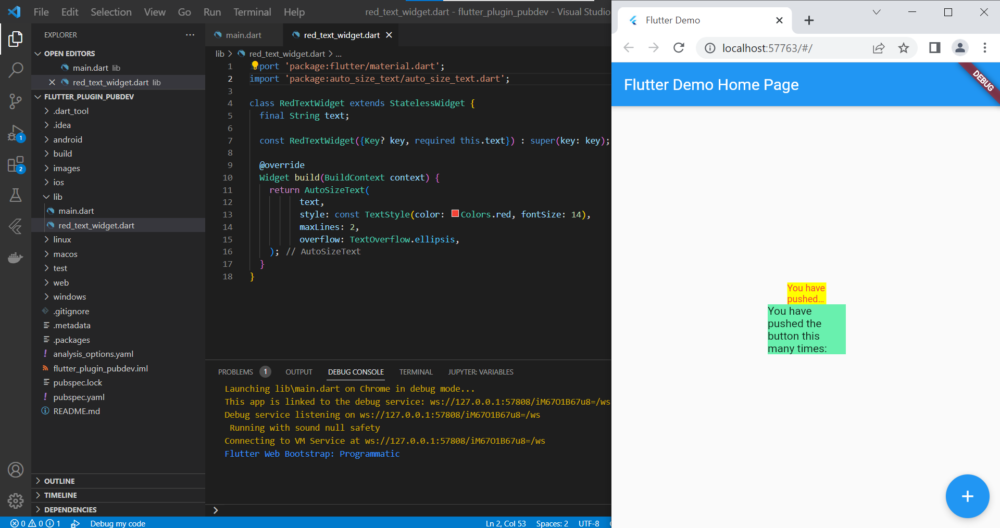

# flutter_plugin_pubdev

## Ouput Praktikum

## Tugas Praktikum

1. Selesaikan Praktikum tersebut, lalu dokumentasikan dan push ke repository Anda berupa screenshot hasil pekerjaan beserta penjelasannya di file README.md!

    <b>jawab : </b> hasil praktikum dapat dilihat di atas.

2. Jelaskan maksud dari langkah 2 pada praktikum tersebut!
    
    <b>jawab : </b> Pada langkah ke-2 menambahkan plugin auto_size_text dengan perintah flutter pub get. Plugin tersebut berfungsi sebagai Widget Flutter yang secara otomatis mengubah ukuran teks agar sesuai dengan batasnya.

3. Jelaskan maksud dari langkah 5 pada praktikum tersebut!

    <b>jawab : </b> Pada langkah ke-5 kita menambahkan variabel dan parameter 'text' pada konstruktor. Variabel tersebut nantinya dipanggil sebagai value dari text pada widget autosizetext.

4. Pada langkah 6 terdapat dua widget yang ditambahkan, jelaskan fungsi dan perbedaannya!

    <b>jawab : </b> Pada widget yang pertama container mempunyai child yang berupa class redTextWidget yang dibuat pada file red_text_widget.dart, dan di dalamnya terdapat parammeter text. Class tersebut mengembalikan widget textAutosize, sehingga banyak baris dan text style mengikuti yang telah dideskripsikan pada widget tersebut. Oleh karena itu, pada widget pertama teks terpotong (penerapan TextOverflow.ellipsis). Sedangkan pada widget yang kedua child berupa widget text biasa.

5. Jelaskan maksud dari tiap parameter yang ada di dalam plugin auto_size_text berdasarkan tautan pada dokumentasi ini !

    <b>jawab : </b> Beriku adalah beberapa parameter di dalam plugin auto_size_text dan fungsinya:
    1. maxLines : Jumlah maksimum baris opsional untuk teks yang akan dibentangkan. Jika tidak ada parameter maxLines yang ditentukan, yang ada AutoSizeText hanyalah teks yang sesuai dengan lebar dan tinggi yang tersedia.
    2. minFontSize : Batasan ukuran teks minimum yang akan digunakan saat mengubah ukuran teks secara otomatis.
    3. maxFontSize : Batasan ukuran teks maksimum yang akan digunakan saat mengubah ukuran teks secara otomatis.
    4. group : Menyinkronkan ukuran beberapa AutoSizeText
    5. stepGranularity : enentukan seberapa besar ukuran font dikurangi setiap langkah. Biasanya, nilai ini tidak boleh di bawah 1untuk performa terbaik.
    6. presetFontSizes : Mendefinisikan semua ukuran font yang mungkin. Jika presetFontSizesdisetel, minFontSize, maxFontSizedan stepGranularityakan diabaikan.
    7. overflowReplacement : Jika teks meluap dan tidak sesuai dengan batasnya, widget ini akan ditampilkan sebagai gantinya.
    8. key : 	Mengontrol bagaimana satu widget menggantikan widget lain pada tree
    9. textKey : mengisi kunci untuk Textwidget yang dihasilkan
    10. textAlign :	Bagaimana teks harus disejajarkan secara horizontal.
    11. textDirection :	Arah teks. Ini memutuskan bagaimana textAlignnilai disukai TextAlign.startdan TextAlign.end diinterpretasikan.
    12. locale :	Digunakan untuk memilih font ketika karakter Unicode yang sama dapat dirender secara berbeda, tergantung pada lokal.
    13. softWrap*	Apakah teks harus putus pada jeda baris lunak.
    14. wrapWords : Apakah kata-kata yang tidak cocok dalam satu baris harus dibungkus. Default untuk trueberperilaku seperti Text.
    15. overflow :	Bagaimana visual overflow harus ditangani.
    16. textScaleFactor : Jumlah piksel font untuk setiap piksel logis. Juga mempengaruhi minFontSize, maxFontSizedan presetFontSizes.
    17. semanticsLabel : Label semantik alternatif untuk teks ini.